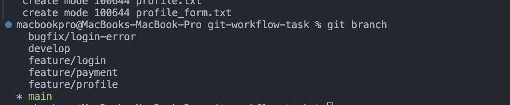
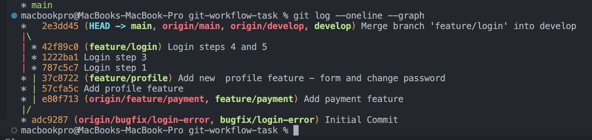
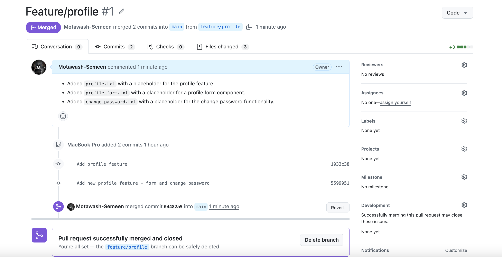
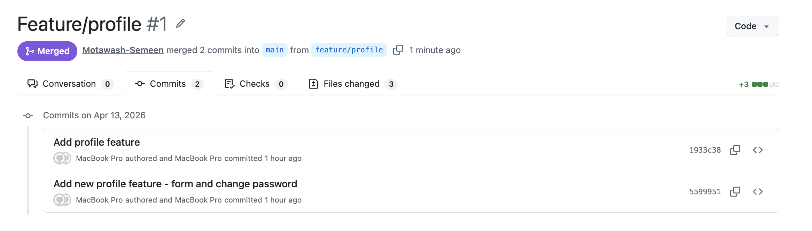
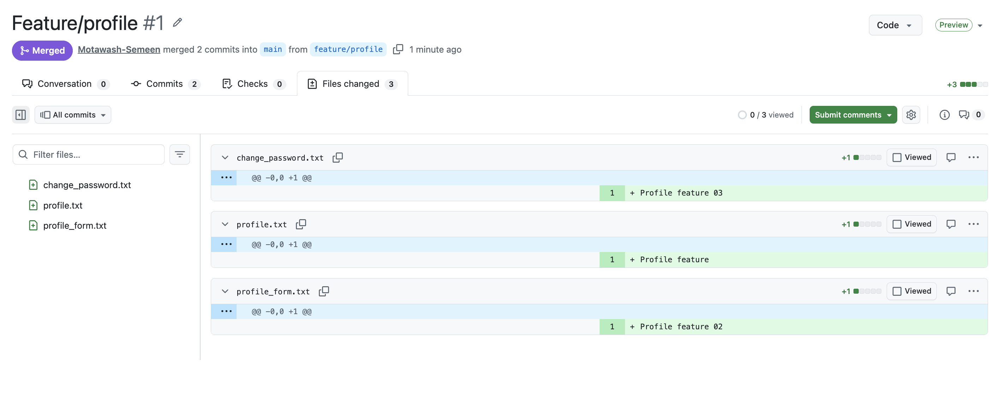

# Git Workflow Task

## Commands Used

### Repository Setup
- git init
- git branch -M main
- git checkout -b develop

### Branching
- git checkout -b feature/payment
- git checkout -b feature/profile
- git checkout -b bugfix/login-error

### Merge Strategy
- git merge feature/payment

### Rebase Strategy
- git rebase develop

### Commit Management
- git rebase -i HEAD~5

---

## Explanation

### Merge vs Rebase

**Merge:**
- Combines branches
- Keeps history
- Creates merge commit

**Rebase:**
- Rewrites history
- Cleaner linear history
- No extra merge commit

---

### Squash & Reword

**Squash:**
- Combines multiple commits into one

**Reword:**
- Changes commit message

---

## Screenshots

## 📸 Branch List

## 📸 Commit History

## 🔀 Pull Request

